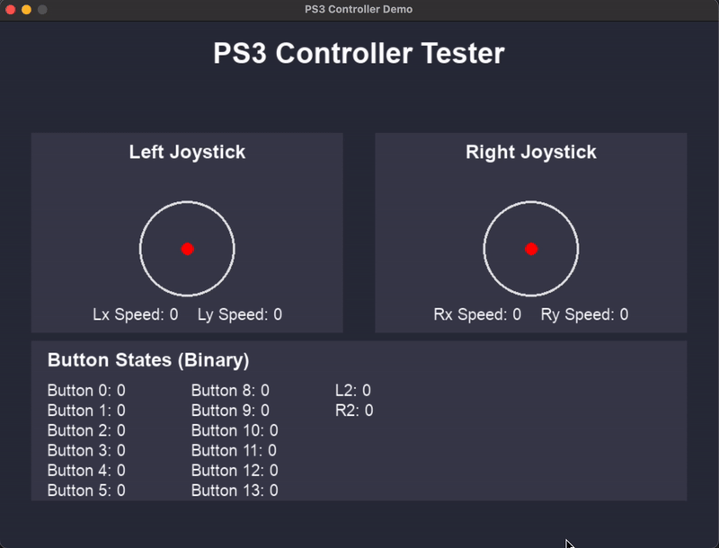

<h1>BOTZO 🐾</h1>

**`The good boy quadruped robot :)`**

    
    
    
    

more [here](https://github.com/IERoboticsAILab/botzo)

# PS4_Controller_Reading

This repository contains the files associated with developing the software to read and acknowledge inputs from the ps4 controller that will be used to control Botzo.

# Controller Input Layout
Below is the current concept for the associations of each button input from the PS4 controller regarding how Botzo will respond to it.

# UI Interface
A simple UI INterface was designed in order to assess whether the software was accurately reading the inputs of the PS4 controller, ensuring accuracy and success when it is used with Botzo, avoiding errors and reducing the overall chances of future possible complications.

https://www.padcrafter.com/?templates=Controller+Scheme+1&plat=1&leftStick=Horizontal+Movement&rightStick=Vertical+Movement&aButton=Jump&bButton=Crouch&rightTrigger=Speed+Up&leftTrigger=Slow+Down&dpadUp=Mode+1%3A+Flat+Terrain&dpadRight=Mode+2%3A+Rocky+Terrain&dpadLeft=Mode+3%3A+Tight+Enclosed+Space&dpadDown=Mode+4%3A+Lockdown+Position&xButton=Quick+Side+Step&yButton=Extend
