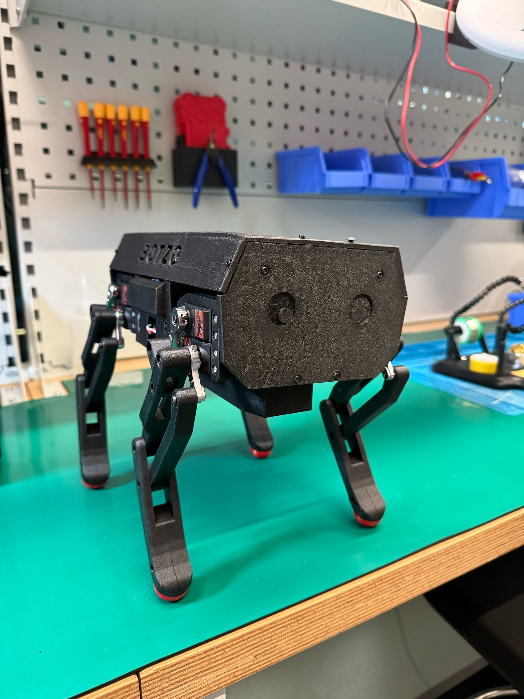

<h1>BOTZO 🐾</h1>

**`The good boy quadruped robot :)`**

    
    
    
    

🚨🚧 **Project Under Construction!** 🚧🚨

Here's a sneak peek of our current progress:

    

    
    

>Stay tuned for updates and feel free to reach out with suggestions! Let's build Botzo together! 🛠️

📬 Email us at: [botzoteam@gmail.com](botzoteam@gmail.com)

Our [Instagram](https://www.instagram.com/botzo.ie/)

## 🌟 **Welcome to the Botzo Project!**

**Botzo** is an autonomous quadruped robot designed to:
- Navigate complex terrains 🌄
- Collect data and samples 📊
- Interact with its environment 🌍

This project combines sleek design, cutting-edge technology, and practical functionality to redefine robotic mobility.

## 📚 **Project Overview**

Botzo's development is divided into multiple phases, each focusing on specific aspects of its design, hardware, and software. We're actively working through these stages to bring the robot to life!

We stand in the middle of a trade of between high quality software and hardware, with low cost and affordability.

**Botzo is aimed to be a strong platform for everyone to replicate under 500€**

## 🏆 **Our Steps**

### Phase 1: Proposal and Circuit Design ✅

- **Processing Unit**: Raspberry Pi 4  (future: Jetson Nano).
- **Actuators**: Optimizing torque for robust movement (25kg servos x3 per leg).
- **Power Supply**: Batteries capable of delivering ~30 minutes of runtime under typical conditions.
- **Sensors**: Integrating components for environmental awareness. Botzo top is universal base for attaching fourther components, such as webcam and LiDAR.

For a deeper dive into this phase, check out our [Canva Board Proposal](https://www.canva.com/design/DAGQqN2k1i4/RCJst_pNSHRcbE02HOKgEw/edit?utm_content=DAGQqN2k1i4&utm_campaign=designshare&utm_medium=link2&utm_source=sharebutton).

  
<strong>Components List</strong>

| Quantity | Component                        | Link         | Price (Single) | Component Total | Status       | Description                           | Measures (cm) |
|----------|----------------------------------|-------------|----------------|----------------|--------------|--------------------------------------|--------------|
| x1       | Arduino Mega                     | Amazon      | 25.99€         | 25.99€         | In the lab   | Control over servos and IMU         |              |
| x1       | Raspberry Pi                     | -           | -              | -              | In the lab   | Brain                                |              |
| x1       | Raspberry Pi camera module V2 8MP | Amazon      | 13.79€         | 13.79€         | In the lab   | Camera module for Raspberry         |              |
| x1       | Buck converter 5V-5A out         | Amazon      | 11.99€         | 11.99€         | In the lab   | Buck converter 5V-5A (25W) for Rpi  |              |
| x5       | Buck converter 5-40V 12A out     | Amazon      | 35.99€         | 35.99€         | In the lab   | Buck converters for servos          | 6x5x2        |
| x12      | Servo DS3225 25kg                | -           | -              | -              | In the lab   | Actuators for legs                  |              |
| x1       | MPU-6050                         | -           | -              | -              | In the lab   | Balancing sensor                    | 2x2.3x0.7    |
| x2       | LiPo batteries RC                | Amazon      | 45.99€         | 91.98€         | In the lab   | Power in series                     |              |
| x1       | Oled Display                     | Amazon      | 9.99€          | 9.99€          | In the lab   | Display informations                |              |
| x1       | PS3 controller                   | Amazon      | 17.99€         | 17.99€         | In the lab   | PS3 controller to move robot        |              |
|        |                    |       |         |        |   |       |              |
| x20      | 8x3x4 mm bearings                | Amazon (x2) | 7.09€          | 14.18€         | Need to buy  | Bearings for moving parts           |              |
| x4 | 10x5x4 mm bearings | | | | | For shoulder stronger axes| |
| x1       | Dean T Connectors                | Amazon      | 9.99€          | 9.99€          | In the lab   | Connection of the circuit           |              |
| x1       | Cables 14 AWG                    | Amazon      | 25.5€          | 25.5€          | In the lab   | Cables high current                 |              |
| x1       | Cables 10 AWG                    | Amazon      | 16.99€         | 16.99€         | Need to buy  | Cables high current                 |              |
| x1       | TPU Bambu filament               | Bambu       | 44.73€         | 44.73€         | Need to buy  | TPU for foot                        |              |
| | Set of M3, M2.5 and M2 screws| | | | | | |
| | Set of inserts for M3, M2.5 and M2 screws | | | | | | |

**Total: 256.39€**

_Price can vary depending on what you already have, but the goal is to stay  under 500€_

 

### Phase 2: Leg Design

Key steps include:
1. Fusion 360 Design ✍️
2. Shock-absorbing dampers 💨
3. Ball bearings for smoother movement ⚙️
4. Servo testing and optimization ⚡
5. Inverse kinematics calculations 📐
6. Designing a test rig for movement evaluation 🛠️

Inspired by servo quadruped designs, the leg focuses on stability and efficient torque distribution. Check out our [Hackaday reference](https://hackaday.io/project/171456-diy-hobby-servos-quadruped-robot/details).

### Phase 3: Whole Body Design 🔧

Developing a comprehensive body framework to house all components.

### Phase 4: Inverse Kinematics 🧮

- Implementing IK for a 3-DoF single leg: [Repository](https://github.com/botzo-team/botzo_IK)
- Rotation matrices and transformations for body movements: [Repository]()

Future improvements include a **parallelized implementation in C++** for better performance.

## 🔮 **Upcoming Phases**

### Phase 5: IMU Readings Integration
Using an Inertial Measurement Unit (IMU) to enhance stability. [Repository](https://github.com/botzo-team/IMU_readings)

### Phase 7: Interpolation and Trot Gait
Implementing trajectory planning and efficient gait algorithms for smoother movement.

### Phase 8: Wireless Controller Integration
Adding wireless control capabilities for remote operation.

### Phase 9: Computer Vision Algorithm
Developing vision algorithms for terrain and object detection.

### Phase 10: Real-Time Simulation Environment
Building a simulation platform for virtual testing.

### Phase 11: IMU Stabilization Algorithm
Creating a stabilization algorithm to maintain balance during movement.

### Phase 12: Reinforcement Learning
Introducing adaptive behavior using RL techniques.

### Phase 13: LiDAR Camera Integration
Adding depth perception capabilities.

### Phase 14: Robotic Arm
Designing and integrating a robotic arm for advanced interaction.

### Phase 15: Botzo App Control Center
Building a mobile app for centralized control of Botzo.

## ✨ **Improvements and Iterative Phases**

This project is a living document. Each phase is iteratively improved to ensure Botzo achieves optimal performance. For example, Phase 7's trot gait will be refined for faster and more fluid motion.

## 📂 **Want to Learn More?**

Check out our shared [Google Drive folder](https://drive.google.com/drive/folders/0AJJugXqFgaoEUk9PVA) for additional resources and documentation.

**Stay tuned for more updates and get involved with the Botzo journey! Contributions and suggestions are always welcome.** 🎉

<!--

# Botzo Documentation

Welcome to the **Botzo Project** documentation. This project aims to develop an autonomous quadruped robot designed for navigating complex terrains, collecting data and samples, and interacting with its environment. Botzo combines a sleek, modern design with practical functionality to achieve this purpose.

---

## **Project Overview**

The Botzo robot is designed with practicality, focusing on autonomous mobility and environmental interaction. Our team is actively working through multiple development phases, each dedicated to a specific aspect of Botzo’s design, hardware, and software.

## **Goals**

### Phase 1: Proposal and Circuit Design ✅

In this initial phase, we researched and selected essential components, considering:
- **Processing**: Jetson/Pi4 options
- **Actuators**: Torque capacity
- **Power Supply**: Battery requirements and converters
- **Sensors**: For environmental awareness
- **Other Components**

With a projected runtime of ~18 minutes under max load, actual tests suggest closer to ~30 minutes of operation. For more details, refer to the [Canva Board Proposal](https://www.canva.com/design/DAGQqN2k1i4/RCJst_pNSHRcbE02HOKgEw/edit?utm_content=DAGQqN2k1i4&utm_campaign=designshare&utm_medium=link2&utm_source=sharebutton).

### Phase 2: Leg Design 🔜

Key steps include:
1. Fusion 360 Design
2. Integration of shock-absorbing dampers
3. Addition of ball bearings
4. Servo testing
5. Inverse Kinematics
6. Design of a testing rig for movement evaluation

Our leg design is inspired by a servo quadruped, focusing on optimized torque distribution and stability. More information can be found in the [Hackaday project reference](https://hackaday.io/project/171456-diy-hobby-servos-quadruped-robot/details).

### Phase 3: Whole Body Design

Development of a complete body framework.

### Phase 4: Inverse Kinematics

Software development of IK in 3DoF for one leg: [repo](https://github.com/botzo-team/botzo_IK)
Software development of Rotation matrices and transormations for body: [repo]()

#### future devellop

in C++ with parallelization support.

---

## **Upcoming Phases**

### Phase 5: IMU Readings Integration
Using an Inertial Measurement Unit (IMU) to provide stability data. [repo](https://github.com/botzo-team/IMU_readings)

### Phase 7: Interpolation and Trajectory Planning & Trot Gait
In this phase, the trajectory planning and a trot gait algorithm will be implemented for movement efficiency.

### Phase 8: Wireless Controller Integration

Developing wireless control capabilities.

### Phase 9: Computer Vision Algorithm

Implementing CV algorithms for object and terrain recognition.

### Phase 10: Real-time Simulation Environment

Building a real-time simulation platform for virtual testing.

### Phase 11: IMU Stabilization Algorithm
A stabilization algorithm to maintain balance.

### Phase 12: Reinforcement Learning
Applying reinforcement learning techniques for adaptive behavior.

### Phase 13: LiDAR Camera Integration
Adding depth perception with LiDAR.

### Phase 14: Robotic Arm
Designing and integrating a robotic arm for interaction.

### Phase 15: Botzo App Control Center
Creating a mobile app for Botzo's centralized control.

---

## **Improvements and Iterative Phases**

Throughout each phase, improvements will be documented and considered for additional development. For example, Phase 7’s trot gait could be optimized with faster algorithms to enhance Botzo's speed and fluidity in movement.

---

For more details, visit the project’s shared [Google Drive folder](https://drive.google.com/drive/folders/0AJJugXqFgaoEUk9PVA).

---

This document serves as an ongoing reference for Botzo’s design and development stages. Contributions and improvements are welcome. -->
