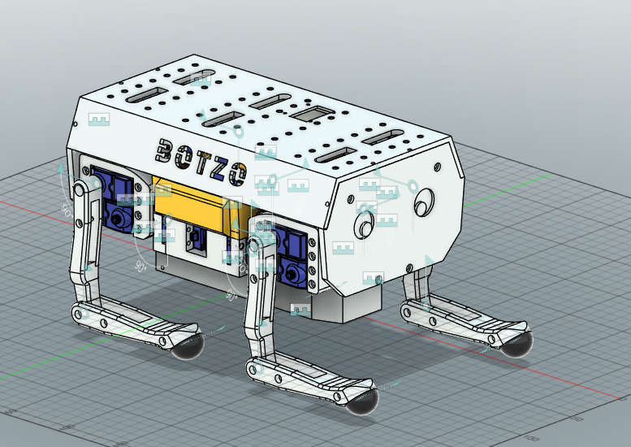

# Robot URDF



[OWR URDF](https://github.com/IERoboticsAILab/botzo/blob/main/CAD_files/URDF/BOTZO_URDF_description/urdf/BOTZO_URDF.urdf)

## What is a URDF and why we need it?

A URDF is a file used in robotics to import the robot in a simulation. It uses the STL/CAD files as a base. Assemble them with rigid or rotatory joins, and save positions of each bone and pivot in the joints. To sum up, it is file that describe your robot in deep details and precision.

## How to create a URDF for Botzo

From the CAD files, we created a URDF file for Botzo using Fusion 360 and [fusion2urdf](https://github.com/syuntoku14/fusion2urdf). A repo that give us a package for exporting URDF from a Fusion 360 packages.

Visit directly the repos if you don't understand something. This is a resume of what they do:

- [Webgraphviz](http://www.webgraphviz.com/) (for debugging purposes)

- [fusion2urdf](https://github.com/syuntoku14/fusion2urdf) (for exporting URDF from Fusion 360 file assembled with joints)


## Result and prcedure

You will use [BOTZO_F360_JOINS.f3d](https://github.com/IERoboticsAILab/botzo/blob/main/CAD_files/URDF/BOTZO_F360_JOINS.f3d) file to build your urdf, or just use ours [here](https://github.com/IERoboticsAILab/botzo/blob/main/CAD_files/URDF/BOTZO_URDF_description/urdf/BOTZO_URDF.urdf).

### Prepare STL
As stated in the [Fusion2PyBullet repo](https://github.com/yanshil/Fusion2PyBullet) and [fusion2urdf](https://github.com/syuntoku14/fusion2urdf), we must **prepare our STL** file properly with strict rules:

1. All bodies/peaces/future links must be **components**.
2. Add physical materials
3. Add **joint** to connect all components. In fusion you can select various type of joint (static, rotational, etc...) and also the pivot point.
4. Call one component as `base_link`
5. Remove links of components (if the are right click on it and press Break Link)
6. Check STL joint-link structure using [Webgraphviz](http://www.webgraphviz.com/). Here how:
    - Download [Joint2Graphviz repo](https://github.com/yanshil/Joint2Graphviz) as a ZIP.
    - Extract the ZIP in a known directory.
    - Open terminal:

        ```powershell
        cd <path to Joint2Graphviz>

        Copy-Item ".\Joint2Graphviz-master\" -Destination "${env:APPDATA\Autodesk\Autodesk Fusion 360\API\Scripts\" -Recurse
        ```

        For me was:
        ```powershell
         cd C:\Users\orlan\OneDrive\Desktop\side_projects\Joint2Graphviz-master

         Copy-Item "..\Joint2Graphviz-master\" -Destination "..\..\..\..\AppData\Roaming\Autodesk\Autodesk Fusion 360\API\Scripts\" -Recurse
        ```
    - Now the script to create a `.txt` file for your link graph is added to fusion
    - Open fusion
    - Open the file of the robot
    - Go to utility > Addins
    - Under `My Script` you should see `Joint2Graphviz`
    - Press it. It will create a `graph.txt`

    - Copy and pase the text content to [Webgraphviz](http://www.webgraphviz.com/) and check your robot tf structure to be valid.

**(for more infors check [Joint2Graphviz readme](https://github.com/yanshil/Joint2Graphviz))**

-----

!!! warning
    
    7. We discovered that URDF does NOT suport close loop. Our leg design is one big close loop. You can check `wrong_graph` folder to see a graph with a close loop... The URDF won't work if there is a close loop

## Export URDF

1. Download [fusion2urdf](https://github.com/syuntoku14/fusion2urdf)
2. Extract the ZIP in a known directory.
3. Open terminal:

    ```powershell
    cd <path to Fusion2PyBullet>

    Copy-Item ".\URDF_Exporter\" -Destination "${env:APPDATA}\Autodesk\Autodesk Fusion 360\API\Scripts\" -Recurse
    ```

    For me was:
    ```powershell
        PS C:\Users\orlan\OneDrive\Desktop\side_projects\Fusion2PyBullet-master> Copy-Item ".\Bullet_URDF_Exporter\" -Destination "..\..\..\..\AppData\Roaming\Autodesk\Autodesk Fusion 360\API\Scripts\" -Recurse
    ```
4. Open fusion > utils > addins > my scripts > Bullet_URDF_Exporter

**(for more infors check [fusion2urdf readme](https://github.com/syuntoku14/fusion2urdf/blob/master/README.md) or [Fusion2PyBullet readme](https://github.com/yanshil/Fusion2PyBullet/blob/master/README.md))**

5. You will recive a folder with all the scrips and files to simulate your robot in ROS/Gazebo or PyBullet. To simply extract the URDF from XACRO use this comand:
    
    ```bash
    ros2 run xacro xacro <your_file>.xacro > <your_file>.urdf
    ```

6. [OWR URDF](https://github.com/IERoboticsAILab/botzo/blob/main/CAD_files/URDF/BOTZO_URDF_description/urdf/BOTZO_URDF.urdf)