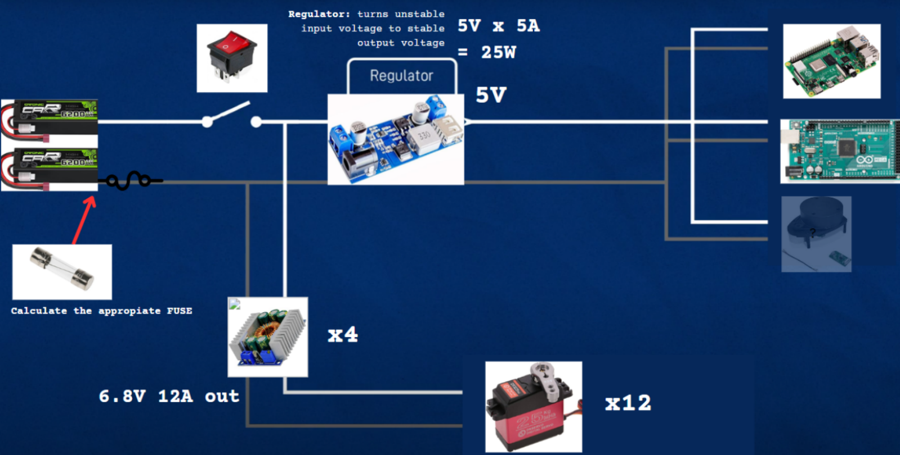
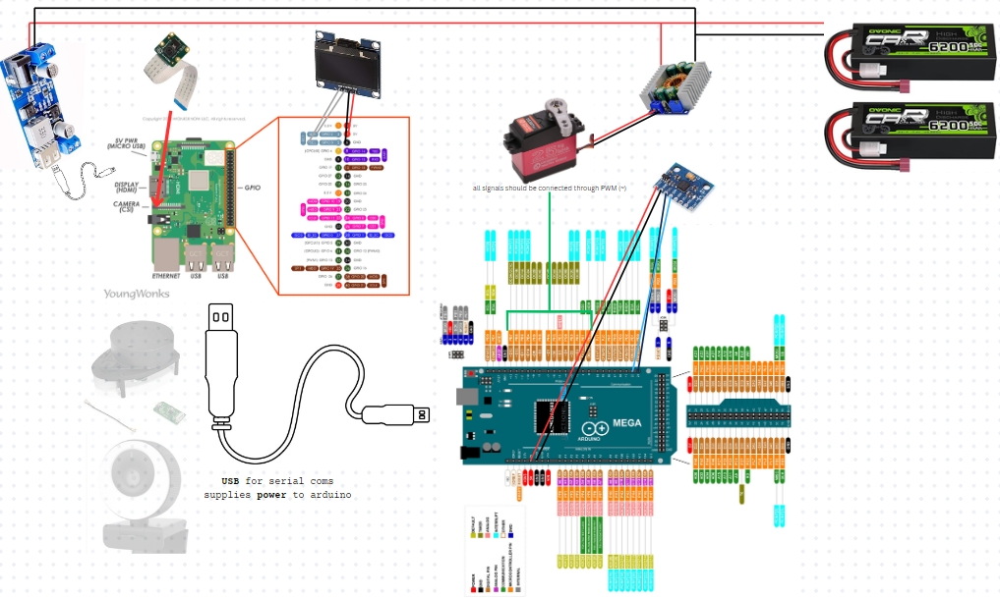

# Hardware

## Overview

Botzo hardware components are aimed at being affordable but still of decent quality.
The components can be summarized by the following 4 types:

- **Processing Unit**: Raspberry Pi 4 (future: Jetson Nano).
- **Actuators**: Optimizing torque for robust movement (25kg servos x3 per leg).
- **Power Supply**: Batteries capable of delivering ~30 minutes of runtime under typical conditions.
- **Sensors**: Integrating components for environmental awareness. Botzo top is universal base for attaching fourther components, such as webcam and LiDAR.

For a deeper dive into this phase, check out our [Canva Board Proposal](https://www.canva.com/design/DAGQqN2k1i4/RCJst_pNSHRcbE02HOKgEw/edit?utm_content=DAGQqN2k1i4&utm_campaign=designshare&utm_medium=link2&utm_source=sharebutton).

<figure markdown="span">
    {width="70%"}
    <figcaption>Full Circuite Schematic highlighting the connections between components.</figcaption>
</figure>
<figure markdown="span">
    {width="70%"}
    <figcaption>Full Circuite Schematic highlighting the connections between components.</figcaption>
</figure>

## Bill Of Materials

<!-- TODO: Links are missing!
    Additionally, this should not reflect on what items are and aren't available in the lab
    but rather for anyone.
-->

### Electronics

| Component                         | Link                             | Price (Single) | Component Total | Description                        | Quantity |
| --------------------------------- | -------------------------------- | -------------- | --------------- | ---------------------------------- | -------- |
| Arduino Mega                      | [Amazon](https://www.amazon.com) | 25.99€         | 25.99€          | Control over servos and IMU        | x1       |
| Raspberry Pi                      | -                                | -              | -               | Brain                              | x1       |
| Raspberry Pi camera module V2 8MP | [Amazon](https://www.amazon.com) | 13.79€         | 13.79€          | Camera module for Raspberry        | x1       |
| Buck converter 5V-5A out          | [Amazon](https://www.amazon.com) | 11.99€         | 11.99€          | Buck converter 5V-5A (25W) for Rpi | x1       |
| Buck converter 5-40V 12A out      | [Amazon](https://www.amazon.com) | 35.99€         | 35.99€          | Buck converters for servos         | x5       |
| Servo DS3225 25kg                 | -                                | -              | -               | Actuators for legs                 | x12      |
| MPU-6050                          | -                                | -              | -               | Balancing sensor                   | x1       |
| LiPo batteries RC                 | [Amazon](https://www.amazon.com) | 45.99€         | 91.98€          | Power in series                    | x2       |
| Oled Display                      | [Amazon](https://www.amazon.com) | 9.99€          | 9.99€           | Display informations               | x1       |
| PS3 controller                    | [Amazon](https://www.amazon.com) | 17.99€         | 17.99€          | PS3 controller to move robot       | x1       |

### Fastners & Materials

| Component                                 | Link   | Price (Single) | Component Total | Description                | Quantity |
| ----------------------------------------- | ------ | -------------- | --------------- | -------------------------- | -------- |
| 8x3x4 mm bearings                         | Amazon | 7.09€          | 14.18€          | Bearings for moving parts  | x20      |
| 10x5x4 mm bearings                        | Amazon | 7.09€          | 7.09€           | For shoulder stronger axes | x4       |
| Dean T Connectors                         | Amazon | 9.99€          | 9.99€           | Connection of the circuit  | x1       |
| Cables 14 AWG                             | Amazon | 25.5€          | 25.5€           | Cables high current        | x1       |
| Cables 10 AWG                             | Amazon | 16.99€         | 16.99€          | Cables high current        | x1       |
| TPU filament                              | Bambu  | 44.73€         | 44.73€          | TPU for foot               | x1       |
| PETG filament                             | Amazon | -              | -               | TPU for foot               | x1       |
| Set of M3, M2.5 and M2 screws             | -      | -              | -               | -                          | -        |
| Set of inserts for M3, M2.5 and M2 screws | -      | -              | -               | -                          | -        |

**Total: 256.39€**

_Price can vary depending on what you already have, but the goal is to stay under 500€_
