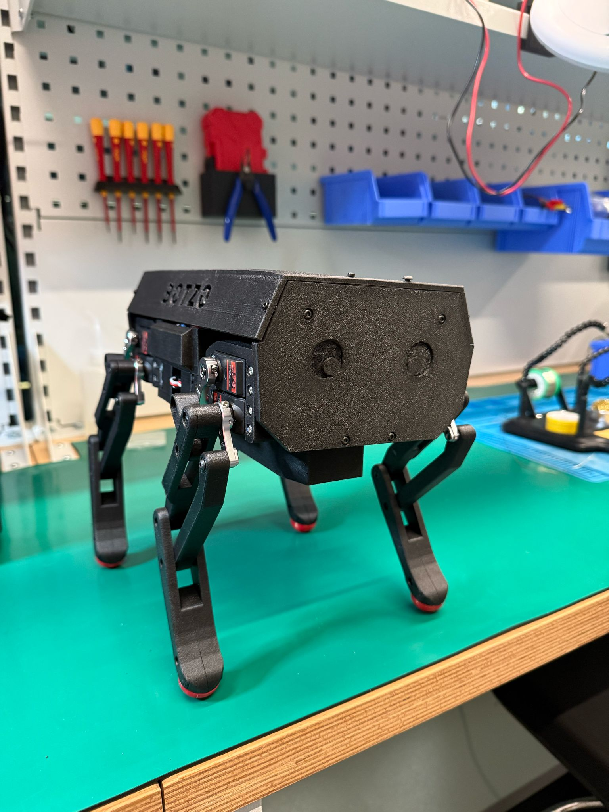

# 🐕 Botzo {align=center}

<i>A legged robot platform designed to learn by building it!</i>

    
    
    

---

{ align=left width="30%"}

**Botzo** is a legged robot platform which is aimed to help students and enthusiasts in robotics
to simulate, build and program a robot. The project aim is to have a robot that it's cost
should be targeted to be under the 500 euros mark.

Furthermore, due to the nature of a quadruped robot,
this platform should excel at the following:

- Navigate complex terrains
- Collect data and samples
- Interact with its environment

## Project Current State

**This project is still in active development and currently in its early stages.**

So far, the platform has gone through component selection, CAD design and assembly,
and building the inverse kinematics model. It's now in the simulation phase,
where the goal is to use **reinforcement learning** to "teach" Botzo how to walk on its own.

## Why Botzo?

**Botzo** is a legged robot platform designed not just to function, but to teach.
It was created with the goal of helping people learn about robotics by building,
experimenting, and exploring key concepts along the way — from hardware design and
assembly to control systems, simulation, and machine learning.

Unlike many robotics kits that act as black boxes, Botzo is open and modular.
Every part of it — mechanical, electrical, and software — is intended to be a
learning opportunity. Whether you're diving into inverse kinematics or training
locomotion with reinforcement learning, Botzo encourages curiosity and hands-on experimentation.

If you're interested in robotics, simulation, or intelligent locomotion,
Botzo isn't just a project — it's a platform for learning.

---

[BOTZO GITHUB REPO](https://github.com/IERoboticsAILab/botzo)