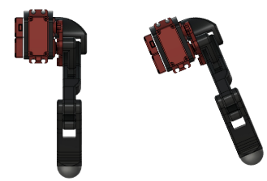
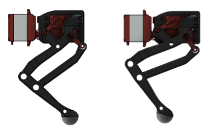
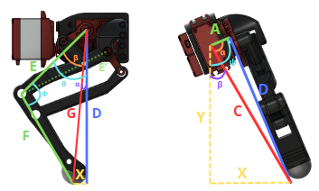
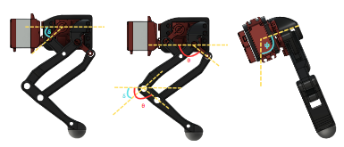
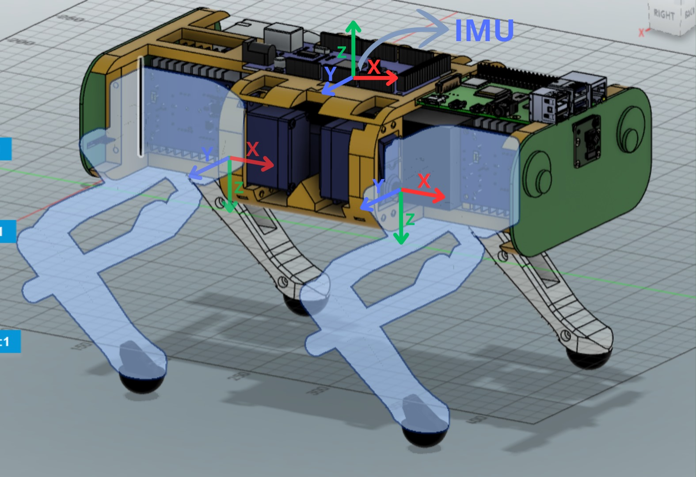
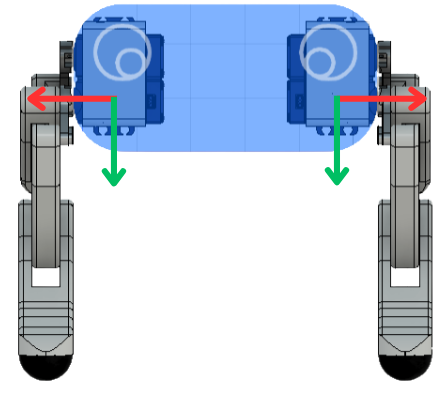
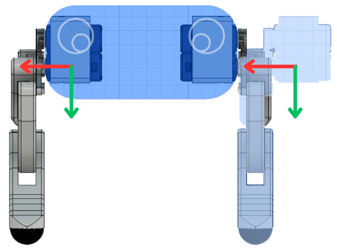
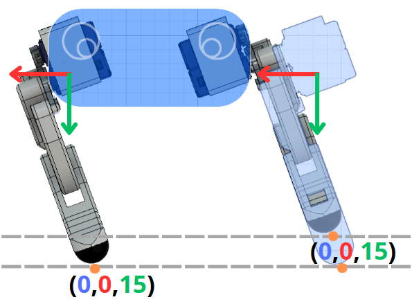
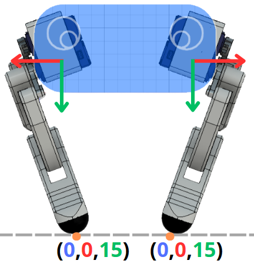

# Inverse Kinematics

Inverse Kinematics (IK) is a mathematical approach used in robotics to determine the necessary joint angles to position an end-effector (like a robotic arm or leg) at a specific point in space. This is particularly useful for robots with multiple degrees of freedom (DoF), such as our botzo v2s, which has 3 DoF per leg.

Inverse Kinematics is used in robots with legs or arms. It is a series of matrix moltiplications and trigonometry formulas (sin, cos,atan2 law of cosin, pitagora, etc...), in order too find the angles each motor in the leg need to have to reach a point in space (x,y,z). Our dog have 3 Degrees of freedom (3DoF), meaning 3 motors per leg.

_On the other side forward kinematics calculate where the end-effector/the foot end up based on given/known angles of each motor._

Both uses known constants such as lenght of each "bone". For Inverse Kinematic also the target point is a known variable, and it allow us to find the angle configuration we need to reach that point in space.


!!! note

    In `coordinates_to_servos.ipynb` we have combined the use of our IK with the transformation from degrees to PWM explained in [calibrate servos repo](https://github.com/IERoboticsAILab/botzo/tree/main/control/inverse_kinematics/servo_calibration)

## 3 DoF IK Of 1 leg





### Solver

Note:

```
coxa = A = 3.1 cm
femur = E = 9.5 cm
real_femur = E' = 9.1 cm
tibia = F = 9.8 cm
θ(coxa) = ψ
θ(knee) = Φ
θ(shoulder) = θ
dist_focuspoint_servo_femurtibia = 2.8 cm
X, Y, Z = given target point
```



1. Distance Calculation

```math
D = \sqrt{Z^2 + Y^2 - \text{A}^2}
```

2. G Calculation

```math
G = \sqrt{D^2 + X^2}
```

3. Knee Angle

```math
\text{Φ} = \arccos\left(\frac{G^2 - \text{E}^2 - \text{F}^2}{-2 \cdot \text{E} \cdot \text{F}}\right)
```

4. Shoulder Angle

```math
\theta_{\text{shoulder}} = \arctan2(X, D) + \arcsin\left(\frac{\text{F} \cdot \sin(\text{Φ})}{G}\right)
```

5. Coxa Angle

```math
\text{ψ} = \arctan2(Y, Z) + \arctan2(D, \text{A})
```

### Translator

Here we will translate the founded angles with the translator in the actual angles we will pass to the robot servos



1. Adjustment

```math
\text{adjustment} = \arccos\left(\frac{\text{real\_femur}^2 + \text{femur}^2 - \text{dist\_focuspoint\_servo\_femurtibia}^2}{2 \cdot \text{real\_femur} \cdot \text{femur}}\right)
```

2. Femur Angle

```math
\theta_{\text{femur}} = \frac{\pi}{2} - (\theta_{\text{shoulder}} + \text{adjustment})
```

3. Tibia Angle

```math
\theta_{\text{tibia}} = \pi - \theta_{\text{knee}} + \text{adjustment} + \theta_{\text{femur}}
```

### Resources

[Spot-Micro](https://spotmicroai.readthedocs.io/en/latest/simulation/)

  - [Spot-Micro GitHub](https://gitlab.com/public-open-source/spotmicroai/simulation/-/tree/master/Basic%20simulation%20by%20user%20Florian%20Wilk/Kinematics?ref_type=heads)

  - [Spot-Micro IK solver video](https://www.youtube.com/watch?v=4rc8N1xuWvc)

[OpenQuadruped/spot_mini_mini](https://github.com/OpenQuadruped/spot_mini_mini)

## Rotation Matrices



!!! note

    Rotation matrices repo: [here](https://github.com/IERoboticsAILab/botzo/tree/main/control/rotation_matrices)

    Rotation matrices docs: [here](https://ieroboticsailab.github.io/botzo/learn/rotation-matrices/)

## IK full body

Use `IK_solver4Lgs.ipynb`. It is a way to manualy retrive angles for each leg to make robot step and walking for the first time.

1. First the code loads known variables, such as the coefficents retrived from the calibration of each servo (find more [here](https://github.com/IERoboticsAILab/botzo/tree/main/control/inverse_kinematics/servo_calibration)).

and robot dimentions.

2. We define some usefull function for later (such as translate read to degrees)

3. We craete a IK solver for each leg. The only thing that changes is the adjustemts need for each leg servo angle. Because some servos has diffrent orientation therfor diffrent zero.

4. Then we manualy define points in the 3D space (x,y,z) inside an array. This points will then later be passed one by one to the IK solvers adn we will return PWM signals for the corrisponding angle that each servo need to have to reach that point.
  - Each leg has his own IK solver, given the fact that the motors are oriented in diffrent ways.
  - Differences from Front to Back: Just in the shoulder angle, infact the servo is oriented on the opposite side. So we just do `180° - angle_in_right`

  *FR*

  ```python
  coxa_angle = deg2rad(180) - (np.arctan2(y,z) + np.arctan2(D,coxa))
  ```

  *BR*
  ```python
  coxa_angle = (np.arctan2(y,z) + np.arctan2(D,coxa))
  ```

  - Differences from Left to Right:

    1. First we have to flip both angles in knee and tibia of about 180°.

    *FR*

    ```python
    femur_angle = deg2rad(90) - (shoulder_angle + adjustment)
    tibia_angle = np.pi - knee_angle + femur_angle + adjustment
    ```

    *FL*

    ```python
    femur_angle = (deg2rad(90) - (shoulder_angle + adjustment))
    tibia_angle = deg2rad(180) - (np.pi - knee_angle + femur_angle + adjustment)
    femur_angle = deg2rad(180) - femur_angle
    ```

    2. We have to change the position of the shoulder. The math think that the shoulder is at the right of the leg, but in the right leg, the shoulder servo is at the left to respect to the leg (indide the robot).

    We want to achive this:

    

    But the math make the robot beleve it is in this configuration (where the leg is duplicated, not mirrored):

    

    So the result of IK solver is something like this (not precise, and mooving on a curve rather than a line):

    

    After the flip we end up in the desire configuration (we basically move the shoulder inside the robot. In other words we flip the output angle of the shoulder based on the vertical line):

    

    *FR*

    ```python
    coxa_angle = deg2rad(180) - (np.arctan2(y,z) + np.arctan2(D,coxa))
    ```

    *FL*

    ```python
    coxa_angle = (deg2rad(180) - (np.arctan2(y,z) + np.arctan2(D,coxa))) - (2 * ((deg2rad(180) - (np.arctan2(y,z) + np.arctan2(D,coxa)))-deg2rad(90)))
    ```


5. We parse the result in a way the we can just copy and paste it in the `test_4legs.ino.ino` arduino code. The arduino code connect to each servo and move them coordinately. So we where able to manualy simulate a Walking Gate. For a more general and sophisticated gate look [here](https://github.com/IERoboticsAILab/botzo/tree/main/control/gait_plan)


---

[BOTZO IK REPO](https://github.com/IERoboticsAILab/botzo/tree/main/control/inverse_kinematics)